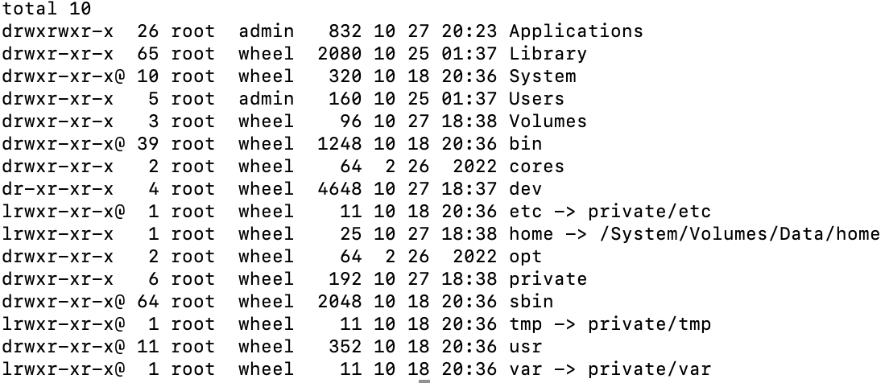
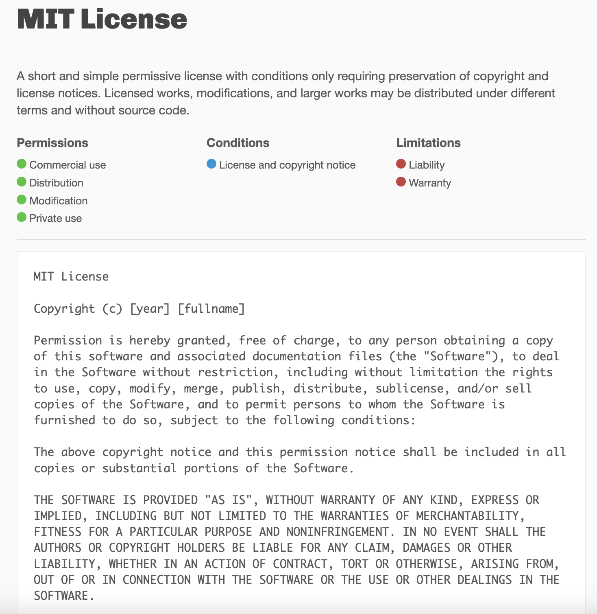

# 开始

Mac的文件夹目录结构如上[^1]: 

每天认识一个开源协议

**专有版权（copyright）**

## 补充身体以及大脑🧠所需营养物

- 运动方面

- 饮食方面

- 线性表的定义

1. 顺序表
2. 链表

你学习 你tm的得跟着敲代

[^1]: 其实跟Linux差不多少

### 数据结构接着来

不带头节点会更麻烦一点

- [ ] 🧵先拆原来的线 然后再连接  不带头节点头插法 特殊处理一下 再继续插入

  *L 「无头骑士」 ->  a1 -> a2 插入 s e*

  *即  s->next = L（**默认指向a1 直接给s->next 就好了**)*

  *❌	s=L 这样就变成了 s节点没了 没人指向了* 

  *✅	L = s   让原来指针s（也就是新加入的节点指针）变成头指针所指。 也就是说 s 和 L 都指向e节点*

  

  > 然后就可以用下面的头插法继续插入了
  >
  > 

- [ ] 🧵先拆原来的线 然后再连接 带头节点 头插法

​		**L「头」->    a1->a2 插入 s e*

​		*此时有P指针* 

​		*P指向头节点，在后面插入s e(**p指向头节点，头节点指向a1**）*

​		*首先让新加入的s指向a1（头节点所指）*

​		*即s->next = p->next(此时二人s p 都指向a1节点)*

​		*p-next = s 让头节点指向s*

- 每次这样理解才能记住，不然背不下来啊 🥹
- 

**大概意思就是，原来a b。加入个c，本来a->b,让c也c->b，最后a再a->c 变成了a->c->b** <u>c就成功加入进来了</u>

是L-a-b-c L有值就是带头节点的 妹纸就是不带头节点的

#### 4

[链接引用]: www.baidu.com	"链接引用失效啦"

[超链接](./images/image-20221027下午104414597.png)

`$a ~~代码~~ a$ <!--注释 -->` ~~删除线~~

H~2~O  下~~标~~

$LaTeX$ 内联公式

~2~

~22~

~~2~~

~~22~~

##### 5

###### 6

Xxxx

# 开始

